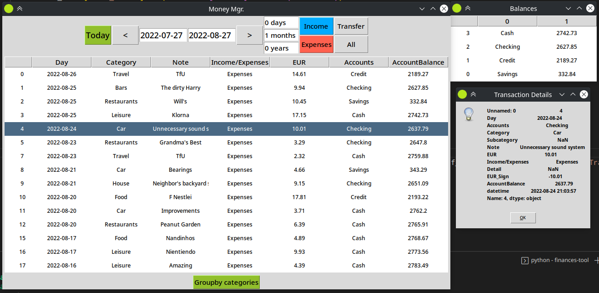

# finances-tool
Python GUI tool for visualizing your everyday finances.

# tl;dr
``` 
cd /path/to/finances-tool/
python3 src/main.py '/path/to/data.xlsx'
```

# Features
* A graphical user interface for navigating through your multi-account movements (Expenses, Income, Transfers, etc..), change the period you want to visualize, show per-category totals, and display only the type of transactions you are interested in with just a click.



* SOON: pie-charts, trends
* SOON: some tools to clean / manipulate your data, adding records

# Dependencies
* pandas
* matplotlib

# How-to
* Data in the shape of a table is expected by the app, only Comma-separated-values (.csv) and excel spreadsheets (.xlsx) are currently supported.
* the app looks in your spreadsheet for a column with a name matching a well-known currency (defined in src/configs/app.yml, e.g. EUR, USD or GBP), this app is not intended at the moment for multi-currency problems, so the first column matching a well-known currency, or whatever name you set in the config file currency list will be used (i.e. if your column header is Bitcoin, just set Bitcoin first in currencies list in app.yml).
* Some column **names / headers** are expected to match those of src/resources/dummy_data.xlsx:
1. Day (e.g. YYYY/MM/DD or ISO format work good)
2. Accounts (nominal / categorical data, e.g. Cash, Checking, Savings, Credit, etc.)
3. Category (nominal / categorical data, e.g. home, rent, groceries, leisure, savings, etc.)
4. EUR / USD / GBP (as explained above)
5. Income/Expenses (nominal / categorical data, explained below)
6. AccountBalance (optional, used to show each account balances in the main frame)
* The 'Income/Expenses' column is quite important, nominal / categorical data is expected, values must be one of the following:
1. Income
2. Expenses
3. Transfer in
4. Transfer out
* As mentioned before, src/resources/dummy_data.xlsx shows a good example of how the data should be formated.
* the content of other columns is irrelevant to the correct functioning of the app.
